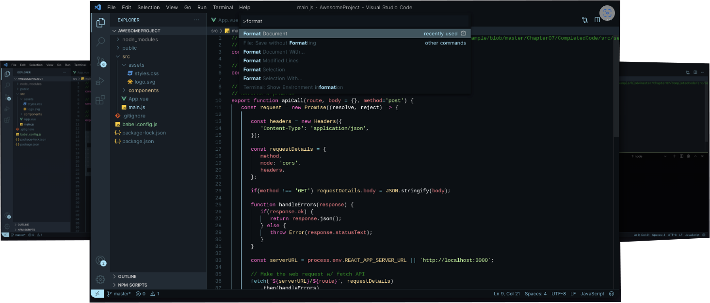

# Blve Theme

Blve is a minimalist and sophisticated VS Code theme that brings together the depth of blue tones with the refreshing serenity of oceanic blue accents. The theme is perfect for those who prefer a dark interface but appreciate a touch of vibrant color for contrast.

## Key Features

- **Deep Blue Background:** A rich, dark blue background that enhances focus and reduces distractions.
- **Accent Color:** `#a2e9ff` – A cool blue inspired by the ocean, adding a fresh and crisp touch to the theme.
- **Blue-Dominant Color Palette:** Mostly blue tones with carefully chosen blue highlights for clarity and aesthetics.

## Installation

1. Open the Extensions sidebar in VS Code.
2. Search for Blve Theme
3. Install and activate the Blve theme from the theme menu.

## Screenshots

## Contributing

Contributions are welcome! Feel free to open issues or submit pull requests to help improve the theme.

---

Dive into the elegance and depth of the Blve theme and make your coding experience a smooth and enjoyable journey!
